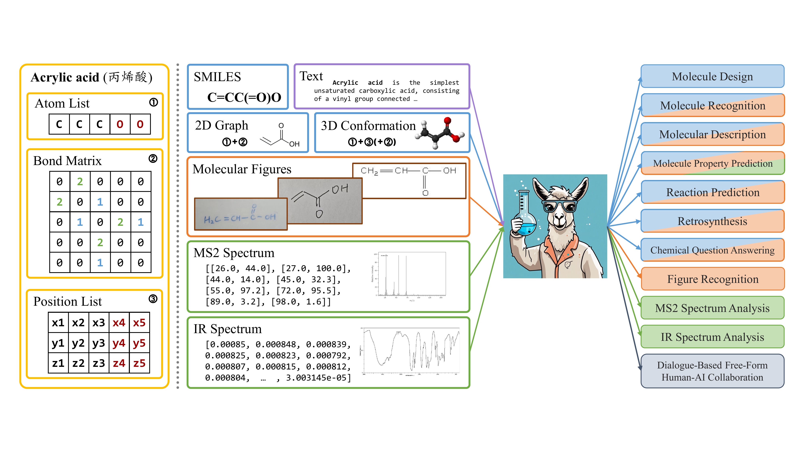

# ChemDFM-X: Towards Large Multimodal Model for Chemistry


## Index
- [Introduction](#introduction)
- [Getting Started](#getting-started)
- [Usage](#usage)
- [Example](#example)
- [Citation](#citation)
- [Disclaimer](#disclaimer)
- [Contact](#contact)

## Introduction
ChemDFM-X is a multimodal model for chemisty, supporting 5 modality files: molecule graph (2D), molecule comformer (3D), molecule picture, mass spectra (MS) and infrared spectrum (IR). 
Every modality data is encoded by a modality encoder: [MoleBERT](https://github.com/junxia97/Mole-BERT), [Uni-Mol](https://github.com/deepmodeling/Uni-Mol/tree/main/unimol), [CLIP](https://github.com/openai/CLIP), and the transformer encoders trained by ourself.  
  
[Paper](https://www.sciengine.com/SCIS/doi/10.1007/s11432-024-4243-0)
[(SI)](https://www.sciengine.com/cfs/files/files/fs/1902619324300918784) &nbsp;
[GitHub](https://github.com/OpenDFM/ChemDFM-X) &nbsp;
[HuggingFace](https://huggingface.co/OpenDFM/ChemDFM-X-v1.0-13B) &nbsp;
[ModelScope](https://modelscope.cn/models/OpenDFM/ChemDFM-X-v1.0-13B)

Overview:


## Getting Started
1. Download ChemDFM-X model parameters from [HuggingFace](https://huggingface.co/OpenDFM/ChemDFM-X-v1.0-13B) or [ModelScope](https://modelscope.cn/models/OpenDFM/ChemDFM-X-v1.0-13B).  
2. Download the demo codes from ChemDFM-X [GitHub](https://github.com/OpenDFM/ChemDFM-X) repository.  
*NOTE: Since ChemDFM-X is an MLLM for chemical modalities, the architecture is not standard LLM or VLM. It requires specific model definition and input preprocess.*  

3. Install the required packages. The prefered enviroment is listed in requirements.txt. We strongly suggest installing PyTorch, PyTorch-Geometry, FlashAttention and Uni-Mol first before the other requirements in Python3.10.  
*NOTE: The version of CUDA and GLIBC on your machine may not support specific package version, that's why we suggest installing these packages first.*  

4. Edit the installed package versions in requirements.txt by your own environments, and run `pip install -r requirements.txt`.

## Usage
1. Run the bash command to launch the command-line interactive demo. Please ensure your environment is activated.  
```bash ./infer/scripts/interact.sh```
2. Give instruction.
3. Give input text mixed with modality tokens (1 token for each file).
4. Give real file path to each of the modality token one by one.  
*NOTE: for batch infer, see the file [./example/C=COF.jsonl](https://github.com/OpenDFM/ChemDFM-X/blob/main/example/C%3DCOF.jsonl) and [./infer/infer_mm_raw.py#L414](https://github.com/OpenDFM/ChemDFM-X/blob/main/infer/infer_mm_raw.py#L414) for details.*

The specital tokens for each modality is listed:


 | modality | modality token | file format | 
 |  :--- | :--- | :--- |
 | molecule **G**raph | [MM_FILE_G] | mol.sdf |
 | molecule **C**omformer | [MM_FILE_C] | mol.xyz |
 | molecule **I**mage | [MM_FILE_I] | mol.png |
 | **M**ass spectra | [MM_FILE_M] | mol.mgf |
 | inf**R**araed spectrum | [MM_FILE_R] | mol.csv |
 
 NOTE: We use the standard file formats to represent the modality data. Sometimes the SMILES is also included in the file format, which we don't use, it is OK to put a dummy SMILES in the file.

## Example
More examples will be updated later.

 | instruction | input | mm_input_files |
 |  :--- | :--- | :--- |
 | Would you please predict the SMILES notation that corresponds to the molecular figure? | **[MM_FILE_I]** | ./example/C=COF.png |
  | | | |
 | Would you please predict the SMILES notation that corresponds to the molecular tandem mass spectrometry? | **[MM_FILE_M]** | ./example/ms.mgf |
 | | | |
 | As a seasoned chemist, you have the SMILES notation with molecular graph of the identified reactants, reagents and products from an incomplete chemical reaction. It appears that some component or components in the products are missing. Using the information presented in the remaining parts of the reaction equation, could you make an educated guess about what these missing substances could be? Please confine your answer to the SMILES of the unknown molecule(s) and avoid incorporating any superfluous information. | SMILES of Reactants: CC(C)[Mg]Cl.CSc1c(F)cc(F)cc1Br.COB(OC)OC \n molecular graph of Reactants **[MM_FILE_G] [MM_FILE_G] [MM_FILE_G]**\nSMILES of Reagents: C1CCOC1\nmolecular graph of Reagents: **[MM_FILE_G]**\nSMILES of Products:\nmolecular graph of Products:\nSMILES of the absent products:\nAssistant:|CC(C)[Mg]Cl.sdf CSc1c(F)cc(F)cc1Br.sdf COB(OC)OC.sdf C1CCOC1.sdf
 | As an accomplished chemist, it's important to use your expertise in anticipating the chemical attributes to predict molecular features. When scrutinizing the molecular conformation of a chemical compound for the estimation of its molecular properties, make sure to retain the original format without infusing any additional data. Judge if the compound's composition has the potential to inhibit (Yes) or not inhibit (No) the Beta-site Amyloid Precursor Protein Cleaving Enzyme 1 (BACE1). Consider elements like molecular weight, number of atoms, types of bonds, and functional groups while examining the compound's potentiality as a viable drug and its probable effectiveness in curing Alzheimer's disease. Give a clear Yes or No answer. | molecular conformation: **[MM_FILE_C]** | ./example/C=COF.xyz |

## Citation
If you use ChemDFM-X in your research or applications, please cite our work:
```bibtex
@article{zhao2024chemdfmx,
  title={ChemDFM-X: towards large multimodal model for chemistry},
  author={Zhao, Zihan and Chen, Bo and Li, Jingpiao and Chen, Lu and Wen, Liyang and Wang, Pengyu and Zhu, Zichen and Zhang, Danyang and Li, Yansi and Dai, Zhongyang and Chen, Xin and Yu, Kai},
  journal={Science China Information Sciences},
  volume={67},
  number={12},
  pages={220109},
  year={2024},
  doi={10.1007/s11432-024-4243-0}
}
```

## Disclaimer
Current version of ChemDFM-X may generate incorrect or misleading information. Please use it with caution and verify the results with domain experts before making any decisions based on the results.

## Contact
If you have any questions or further requests, please contact [Zihan Zhao](mailto:zhao_mengxin@sjtu.edu.cn), [Bo Chen](mailto:chenb@szlab.ac.cn) and [Lu Chen](mailto:chenlusz@sjtu.edu.cn).
